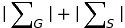
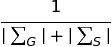
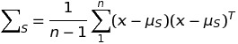
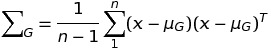

## Horizon Detection

Horizon detection or sky segmentation is the problem of finding a boundary between sky and non sky regions in a given image. This can have many applications especially in navigation of UAV. This problem has been tackled by many and there are mainly two ways of solving this:

* Edge detection
* Modeling sky and non sky regions using machine learning

In most of the early attempts of this problem, there is an underlying assumption that the horizon boundary is linear. This post also discusses one such method by Ettinger which uses latter of the two ways discussed above.

The basic algorithm in that the sky and ground are modeled as two different gaussian distributions in RGB space, and then horizon line is a line segment separating the two, which can found by maximizing an optimization criterion. Thus sky and ground regions are represented as two set of points each distributed about a separate mean point in the RGB space. We then perform a search through potential set of lines (m,b), to find the line with highest likelihood of being the best fit horizon line. Now we just need to find the scalar term for the optimization criterion.
Intuitively, given the pixel groupings, we need to quantify the assumption that a sky pixel will look similar to other sky pixels and likewise for the ground ones. Thus we are definitely looking for a degree of variance in each distribution. Now we want to obtain a single measure of variance from a three dimensional data. We know that the three eignevalues of the covariance matrix represent the degree of variance from the mean along the three principal axes, thus a product of these eigenvalues is a good scalar value. Since product of eigenvalues is the determinant of the matrix, we can say we need to minimize the following function,

or rather maximize the following function:

where,

The above function needs some adjustments in case the covariance matrix is singular, but this function performs pretty well as can be seen in the images below. The code for the implementation is linked below.
